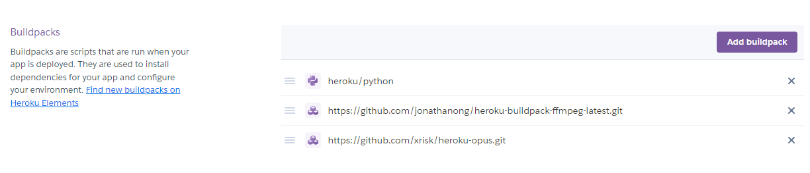

# Shaymin
- [ギラティナ](https://github.com/SehataKuro/Giratina)をもとに音楽の再生機能などの基本的な機能だけを実装したミニバージョンです。
- ギラティナは更新しますがこちらのシェイミは更新しません。ギラティナを参考に修正したりしてください。ytdlpを更新しないと音楽が再生できなくなるかもしれません。
- バグが残ってるかもしれませんが自己責任でお願いします。
# 導入の仕方
ほぼ[これ](https://qiita.com/1ntegrale9/items/aa4b373e8895273875a8)と一緒です。

違う点は、3のリポジトリをシェイミに変えることだけだと思います。

Herokuに必要なビルドパックはこの3つです。

## メインコマンド
### !help
コマンド一覧を表示します。
### !ping
BotサーバーとDiscordサーバー間のPingを表示します。
## 音楽系コマンド
### !join
ボイスチャンネルにBotを追加するためのコマンドです。  
コマンドを使う人がボイスチャンネルに参加している必要があります。
### !leave
ボイスチャンネルからBotを退出させるコマンドです。
### !nowplaying, !np
再生している曲の情報とリンクを表示するコマンドです。
### !play, !p
曲を流すコマンドです。大抵のサイトに対応しています。  
リンクでの再生のほか、検索ワードでの再生も対応しています。  
再生中に曲を追加するとキューに追加されます。
### !queue, !q
キューを表示するコマンドです。  
現在再生中の曲と以降再生される10個の曲を表示します。
### !skip, !s
現在再生中の曲をスキップするコマンドです。  
キューが残っている場合には次の曲を再生します。
### !shuffle
キューをシャッフルします。
### !stop
曲を止めるコマンドです。キューもリセットされます。